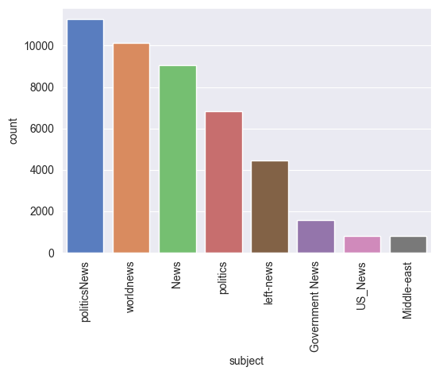

# TruthGuard

TruthGuard is an AI-assisted fake-news detection system built for a Final Year
Project. It uses Random Forest classification as the primary classifier and
Malaysian trusted-source verification as supporting evidence.

Post-result awareness guidance is deterministic and available in Bahasa Melayu
and English.

## Project Scope

TruthGuard's trusted-source verification is intentionally focused on Malaysian
news coverage. It searches a curated list of Malaysian news portals,
fact-checking sites, and public broadcasters.

The Random Forest classifier analyses English-language writing patterns, but
the supporting source search is **not a global fact-checking service**.
International news may still be assessed by the classifier, although supporting
coverage may be limited when the story is not reported by the indexed Malaysian
sources.

## Project Objectives

- Identify real-news and fake-news writing patterns using Random Forest.
- Search trusted Malaysian news sources for related coverage.
- Explain the assessment without presenting it as final proof.
- Improve user awareness and encourage safer sharing decisions.

## System Workflow

1. The user submits news content, with an optional headline and original URL.
2. Malay content is translated to English because the trained model uses an
   English-language dataset.
3. TF-IDF converts the processed text into numerical features.
4. The Random Forest model predicts a real-news or fake-news writing pattern.
5. The system searches trusted Malaysian sources using Google News RSS, cached
   RSS feeds, and DuckDuckGo fallback search.
6. Retrieved articles are ranked using headline and content similarity.
7. Deterministic decision rules produce the final assessment.
8. Bilingual user-awareness messages and safe sharing actions are displayed.

## Dataset Description

The model was trained using the ISOT fake news dataset, which contains real and
fake English news articles. The dataset is stored in `archive/training/dataset/`
as two CSV files:

| File | Label Used by Model | Articles | Source Description |
|---|---:|---:|---|
| `True.csv` | `0` Real-news pattern | 21,417 | Truthful news articles collected from Reuters. |
| `Fake.csv` | `1` Fake-news pattern | 23,481 | Fake news articles collected from unreliable sources flagged by fact-checking and public reference sources. |
| **Total** |  | **44,898** |  |

Each article contains the following fields:

| Field | Description |
|---|---|
| `title` | News headline |
| `text` | Full article text |
| `subject` | News category or topic |
| `date` | Publication date |

Subject distribution:

| Dataset | Subject | Articles |
|---|---|---:|
| Real news | politicsNews | 11,272 |
| Real news | worldnews | 10,145 |
| Fake news | News | 9,050 |
| Fake news | politics | 6,841 |
| Fake news | left-news | 4,459 |
| Fake news | Government News | 1,570 |
| Fake news | US_News | 783 |
| Fake news | Middle-east | 778 |



The dataset is mainly focused on political and world news topics from around
2016 to 2017. Because the dataset is English-language, Malay input in the app is
translated to English before classification.

## Model Training and Evaluation

The machine learning classifier was trained in
`archive/training/fake_news_random_forest.ipynb` using the English ISOT fake
and real news dataset. The trained artefacts are saved as:

- `random_forest_model.pkl`
- `tfidf_vectorizer.pkl`

The model uses TF-IDF text features with a Random Forest classifier. In the
training notebook, the held-out test evaluation produced the following result:

| Metric | Result |
|---|---:|
| Accuracy | 99.69% |
| Test samples | 11,732 |
| Macro average precision | 1.00 |
| Macro average recall | 1.00 |
| Macro average F1-score | 1.00 |
| Weighted average precision | 1.00 |
| Weighted average recall | 1.00 |
| Weighted average F1-score | 1.00 |

Confusion matrix from the notebook:

```text
[[6348   11]
 [  25 5348]]
```

These results show strong performance on the prepared test dataset. In the
deployed application, the model result is still treated as an advisory writing
pattern signal, not final proof that every claim in an article is true or
false.

## Final Assessments

| Assessment | Meaning |
|---|---|
| **Likely Real** | Available model and/or trusted-source evidence provides reasonable support. |
| **Likely Fake** | The model detects fake-news patterns without sufficient trusted-source support. |
| **Needs Further Verification** | Evidence is weak, unavailable, incomplete, or conflicting. |

TruthGuard provides an advisory assessment. None of these labels should be
treated as final proof that a claim is true or false.

## Understanding the Indicators

### Model Confidence

Model Confidence is the Random Forest model's confidence in its detected
writing pattern. It is **not** the percentage that the submitted news is true.

| Category | Confidence |
|---|---|
| High | 90% or above |
| Moderate | 60% to below 90% |
| Low | Below 60% |

### Trusted Source Match

Trusted Source Match measures how closely the submitted news resembles the
single best-matching article found from a trusted Malaysian source. It is
**not** the percentage that the submitted news is true.

The score is calculated using:

```text
Trusted Source Match =
(Headline Similarity x 70%) + (Content Similarity x 30%)
```

The headline similarity, content similarity, and final score shown in the UI
all come from the same best-matching article.

| Category | Similarity |
|---|---|
| Strong Match | 15% or above |
| Possible Match | 10% to below 15% |
| No Match | Below 10% |

A high similarity score means related coverage was found. It does not prove
that every submitted claim or detail is correct.

## Decision Rules

Random Forest remains the primary classifier. Trusted-source verification is
supporting evidence, and the two percentages are never combined into an
overall truth score.

| Model Confidence | Supporting Evidence | Final Assessment |
|---|---|---|
| High | Any verification result | Follows the Random Forest prediction |
| Moderate | Real-news pattern with Strong Match | Likely Real |
| Moderate | Fake-news pattern without Strong Match | Likely Fake |
| Moderate | Possible Match or unavailable verification | Needs Further Verification |
| Low | Strong Match | Likely Real |
| Low | Anything else | Needs Further Verification |

A low-confidence fake-news pattern cannot produce `Likely Fake` on its own.

## Trusted Malaysian Sources

```text
bernama.com             rtm.gov.my                 berita.rtm.gov.my
sebenarnya.my           jomcheck.org               thestar.com.my
nst.com.my              malaymail.com              freemalaysiatoday.com
malaysiakini.com        themalaysianreserve.com    theedgemalaysia.com
thevibes.com            bharian.com.my             hmetro.com.my
sinarharian.com.my      utusan.com.my              kosmo.com.my
astroawani.com          malaysia.news.yahoo.com    therakyatpost.com
says.com                vulcanpost.com             lowyat.net
```

A URL from a trusted domain only helps prioritise the search. It never
automatically marks the submitted news as real.

The curated list improves transparency and keeps the verification scope
defensible for this project. A source being absent from the list does not mean
that the source is unreliable or that its reporting is false.

## User Interface Flow

### Before Analysis

- Compact system overview and feature cards
- Collapsed bilingual User Guide
- Privacy and safety notice
- News Content field, optional headline, and optional original URL
- Input length and URL validation

### After Analysis

1. `View Submitted News`
2. `Final Assessment card`
3. `User Awareness & Safe Sharing Guidance`
4. `Check Another News`
5. `Why did I get this result?`
6. `Related Trusted Articles`
7. `Advanced Technical Details`

After a successful analysis, the input form is hidden and the submitted news is
preserved for reference. Selecting `Check Another News` clears the current
analysis and returns the user to an empty input form.

## User Awareness and Safe Sharing Guidance

The system displays deterministic guidance based on the final assessment. No
external language model is used.

Each Bahasa Melayu and English tab contains:

- **Awareness Message:** explains misinformation risks and warning signs.
- **Safe Actions:** provides practical steps before sharing the news.

This feature supports the project's user-awareness objective while keeping the
guidance consistent and available without an external API.

## Privacy and Security Notes

- Do not submit passwords, personal information, or confidential data.
- Submitted content is processed for classification, translation when needed,
  and trusted-source searching.
- Translation and source-search features may communicate with third-party
  services.
- Submitted URLs must begin with `http://` or `https://`.
- A trusted domain is supporting evidence only and is never automatically
  treated as proof.
- External requests use timeouts, and technical errors are not intended to be
  shown as final proof.

## Limitations

- The Random Forest model was trained using the English ISOT dataset.
- Malay text depends on translation before classification.
- Writing-pattern classification does not independently verify every factual
  claim in an article.
- Trusted-source search results depend on network availability, indexing, and
  the coverage available from Malaysian sources.
- Very recent, niche, international, or poorly indexed news may produce limited
  supporting evidence.
- Related trusted coverage can still differ in date, context, or factual detail.

## Future Work

- Expand source verification to a separately validated list of international
  news organisations and fact-checking services.
- Support multilingual classification and source matching without relying only
  on English translation.
- Re-evaluate similarity thresholds using Malaysian and international
  validation datasets before introducing global coverage.
- Clearly distinguish Malaysian and international supporting evidence in the
  user interface.

## Project Structure

```text
fake_news_rf_fyp - testing 3/
|-- app.py
|-- config.py
|-- assets/
|   `-- dataset_subject_distribution.png
|-- services/
|   |-- __init__.py
|   |-- model_service.py
|   `-- source_verification.py
|-- utils/
|   |-- __init__.py
|   `-- text_processing.py
|-- ui/
|   |-- __init__.py
|   |-- components.py
|   `-- styles.py
|-- tests/
|   |-- __init__.py
|   `-- test_core.py
|-- archive/
|   `-- training/
|       |-- fake_news_random_forest.ipynb
|       `-- dataset/
|           |-- Fake.csv
|           `-- True.csv
|-- random_forest_model.pkl
|-- tfidf_vectorizer.pkl
|-- TGLogo.png
|-- requirements.txt
|-- README.md
`-- .gitignore
```

### Main Responsibilities

| Path | Responsibility |
|---|---|
| `app.py` | Streamlit page setup and high-level user flow |
| `config.py` | Constants, trusted domains, feeds, thresholds, and input limits |
| `services/model_service.py` | Model loading and final assessment rules |
| `services/source_verification.py` | URL checks, searches, similarity, and article ranking |
| `utils/text_processing.py` | Cleaning, language detection, translation, and keyword extraction |
| `ui/components.py` | Result card, awareness guidance, articles, and detail expanders |
| `ui/styles.py` | Application styling and responsive layout |
| `tests/test_core.py` | Focused tests for URL checks, decision rules, and similarity formula |
| `archive/training/` | Training notebook and datasets retained as FYP evidence |

## Run Locally

```powershell
pip install -r requirements.txt
streamlit run app.py
```

The application entry point is `app.py`. No secrets or external API keys are
required.

## Run Tests

```powershell
python -B -m pytest -p no:cacheprovider -q
```

Current verified result:

```text
20 passed
```

The focused unit tests do not require network access or loading the trained
model files.

## Dependencies

| Package | Purpose |
|---|---|
| `streamlit` | Web interface |
| `scikit-learn` | Random Forest, TF-IDF, and similarity calculation |
| `joblib` | Loading the trained model and vectorizer |
| `nltk` | English stopwords and lemmatization |
| `requests` | RSS and source-search HTTP requests |
| `feedparser` | RSS and Atom feed parsing |
| `duckduckgo-search` | Fallback trusted-source search |
| `langdetect` | Input-language detection |
| `deep-translator` | Malay-to-English translation |

## Current Version Highlights

- Random Forest remains the primary classifier.
- Source verification is supporting evidence only.
- Similarity values are taken from one consistent best-matching article.
- Input form uses length and URL validation.
- Results persist until `Check Another News` is selected.
- Bilingual user-awareness guidance is deterministic.
- Code is organised into focused modules for easier review.
- Core automated tests currently pass.

---

**TruthGuard v1.0**  
Final Year Project, University College TATI  
Developed by Iaiman Ilyas bin Azmi
